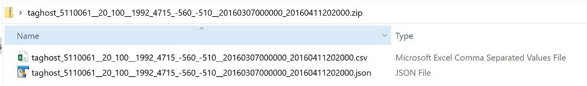
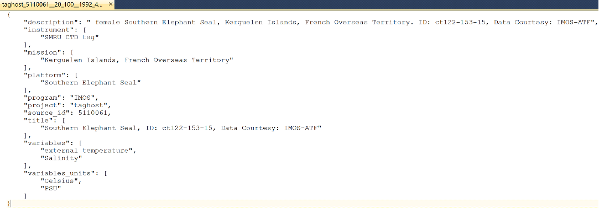
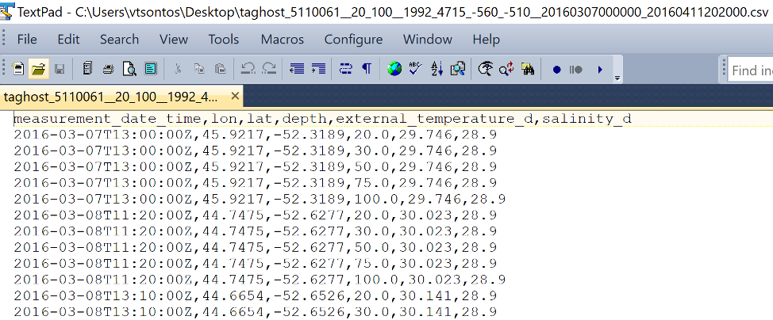

# COVERAGE In-situ Subsetting Service (ISS)

## Quick Build

1. Modify `SOLR_URL` in [config.py](./config.py) to point to a COVERAGE Solr instance.
2. Build the Docker image: `docker build --no-cache -t coverage/in-situ-subsetter:latest .`
3. Start the Docker container: `docker run -d --rm -p 8104:8104 coverage/in-situ-subsetter:latest`

## Overview

The [COVERAGE](https://coverage.ceos.org/) project has developed a generalized data infrastructure supporting the full spectrum of in-situ spatial data types, including point/station, profile, trajectory time series and combinations of these. Integral to this is the implementation of a Web-based subsetting service, the _In-situ Subsetting Service_ (ISS). The associated Application Programming Interface (API) facilitates flexible querying and extraction of diverse kinds of in-situ data by user defined 3D-spatial bounding box, time range and dataset criteria for the range of COVERAGE data holdings.

This document serves as a user guide to ISS. It provides a complete specification of web queries URLs to the _In-situ Subsetting Service_ API, the form of outputs, a series of examples illustrating these capabilities, and a list of the growing number of in-situ data holding currently supported with associated dataset identifier keys used in queries.

## API Web-query Specification

The structure of the URL used in Web-queries to the ISS API with a complete specification of supported query parameters is given below.

```
http://localhost/iss?program=PROGRAM&source_id=SOURCEID&datasource=DATASOURCE&format=[zip,csv,json]&lat_max=LATmax&lat_min=LATmin&lon_max=LONmax&lon_min=LONmin&start_date=DATETIMEmin&end_date=DATETIMEmax&depth_min=DEPTHmin&depth_max=DEPTHmax
```

Where:

|Parameter     |Description   |
| ------------ | ------------ | 
| http://localhost/iss | is the server address where ISS is hosted, and ? specifies the start of the query string. |
|program=PROGRAM (**)|PROGRAM the name of the program/project associated with the dataset to be queried (from table 1).  It is a required field if DATASOURCE is not specified.|
|source_id=SOURCEID (*)|SOURCEID is a required field and the numeric identifier of the dataset to be queried (from table 1).|
|datasource=DATASOURCE  (**)|DATASOURCE is the name of the data collection or store (from table 1) holding the dataset of interest.|
|format=[zip,csv,json]|Format is a required field that can take one of three values: zip, csv or json.  The json option returns just the granule level metadata associated the subsetting request and data file outputs. Specifying csv as the format parameter returns just the subset data outputs in ASCII comma separated value format.  Usage of a zip output format switch results in a zip-file being returned containing both the json metadata and csv output files.|
|lat_max|Spatial bounding box Maximum Latitude for subsetting query (not required with a default value of 90)|
|lat_min|Spatial bounding box Minimum Latitude for subsetting query (not required with a default value of -90)|
|lon_max|Spatial bounding box Maximum Longitude for subsetting query (not required with a default value of 180)|
|lon_min|Spatial bounding box Minimum Longitude for subsetting query (not required with a default value of -180)|
|start_date|DATETIMEmin : optional minimum date/time query filter in ISO-8601 format (YYYY-MM-DDTHH:MM:SSZ eg.2016-04-11T20:20:00Z).  If unspecified, the global minimum date/time value of the given dataset is used by default.|
|end_date|DATETIMEmax : optional maximum date/time query filter in ISO-8601 format (YYYY-MM-DDTHH:MM:SSZ eg.2018-10-30T00:00:00Z). If unspecified, the default value used is the current date/time.|
|depth_min|DEPTHmin : optional query minimum depth filter value. If unspecified, the dataset’s global minimum depth value is used by default.|
|depth_max|DEPTHmax : optional query maximum depth filter value. If unspecified, the dataset’s global maximum depth value is used by default.|

\*  		Required parameter

\*\*		Contingent required parameter (PROGRAM  or DATASOURCE)

NOTE: Case Sensitivity of SSI API parameters

* URL query parameters always need to be specified as lower case (attributes in left column of the listing above, such as “program”, “format”, etc.).
  
* Values are generally not case sensitive, and can be given as either upper or lower-case characters. Entries for the “datasource” and “program” attributes are the only exception for which values are required all in lower-case.

## Sample Outputs

Outputs from an ISS subsetting query are described below.  These include metadata for the subset dataset in json format, the extracted data subset in csv format, all of which can be packaged together in a single zip output file depending on the format specified by the user in the query request URL.  In future, a further, netcdf file output option will be available that consolidates both subset data and metadata in CF/ACDD standards compliant format.

### File Naming Convention
File names of ISS output files usefully reflect and are constructed from the elements comprising query parameter inputs separated be a double underscore:

```
datasource__source_id__depth_min__depth_max__Lon_min__Lon_max__ Lat_min__Lat_max start_date __end_date.format
```

An example based on query #4 above is given here:

```
taghost_5110061__20_100__1992_4715_-560_-510__20160307000000_20160411202000.zip
```

Note that Latitude, Longitude minimum and maximum values are not given in decimal degrees notation but rather as a continuous string without the decimal point delimiters.  The notional position of the decimal point is two characters to the left of the termini. In the example above, Lat_min and Lat_max are -5.60 and -5.10 respectively and Lon_min and Lon_max 19.92 and 47.15 respectively.

### Zip-file Contents

Zip output files resulting from an ISS subsetting operation include both the json metadata file and the csv file with the subset data extracts (Figure 1).

_Figure 1. ISS output zip-file contents._


### Output Metadata

Figure 2 shows the contents of a sample json metadata file resulting from an ISS query. It includes metadata for a range of fields for the selected in-situ dataset, including descriptive information on the dataset, information on the sampling platform and instrument, and metadata on the measurement variables and associated units.

_Figure 2. ISS query JSON Metadata for the S. Elephant seal tagging dataset._


### Extracted Data Outputs

Extracted data from an ISS subsetting query are output in simple columnar, comma separated value (csv) format (Figure 3). The first row contains header information with labels for each field describing the contents of each column. The first four columns in sequence always are: measurement date/time, longitude, latitude, and depth. These are followed by a number of columns with data for potentially an arbitrary number of measurement variables. In the case of the S. Elephant seal here, there are only two columns for water temperature and salinity. The units associated with each measurement variable are given in the accompanying metadata file.

_Figure 3. ISS query example CSV outputs for the S. Elephant seal tagging dataset._

